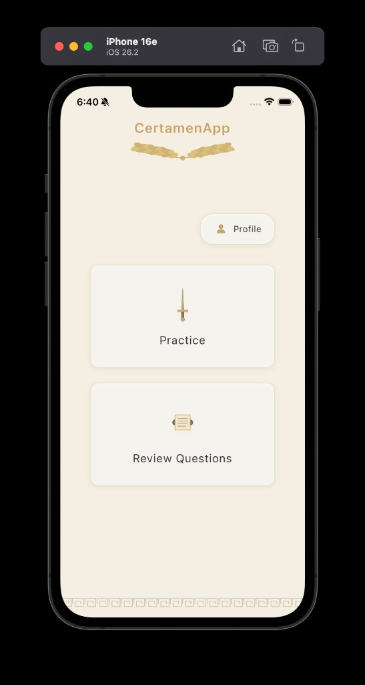
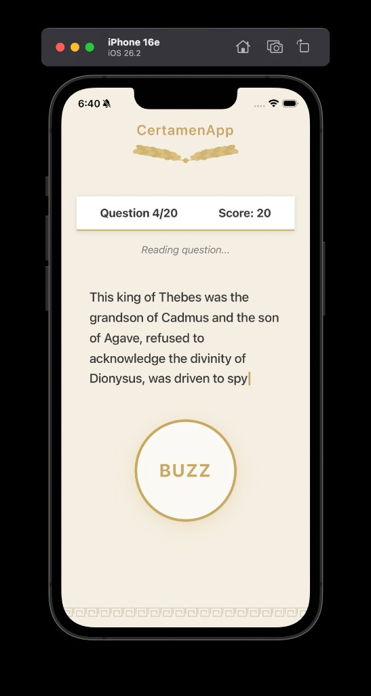
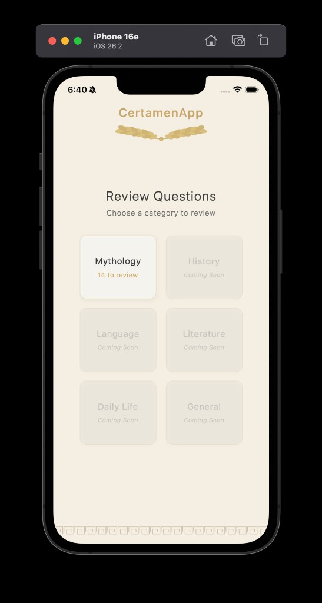
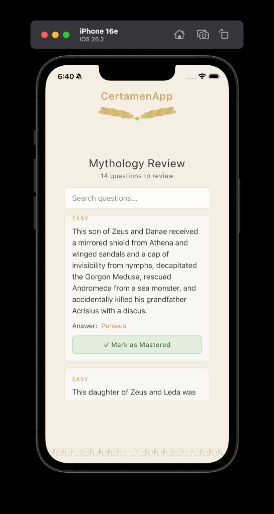
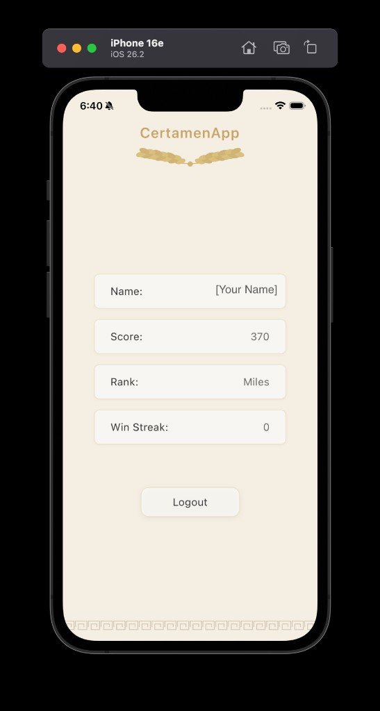
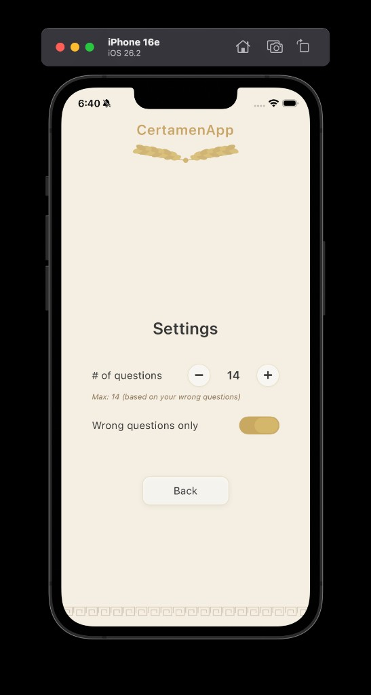

# CertamenPrep 🏛️

A mobile learning application for practicing Certamen questions with a beautiful Roman-themed UI. Master your knowledge of Roman mythology, history, language, literature, and culture while tracking your progress through a gamified rank system.



**[Changelog](CHANGELOG.md)** — release notes and version history (same Markdown rendering as this README on GitHub).

**[Dev log](DEVLOG.md)** — day-to-day notes for the team (newest entry at the top).

---

## 📱 Overview

CertamenPrep is a comprehensive practice tool designed for students preparing for Certamen competitions. The app provides an engaging way to study through adaptive difficulty, progress tracking, and a dedicated review system for questions you've gotten wrong.

---

## ✨ Key Features

### 🎯 Rank-up Mode
- **Adaptive Difficulty**: Questions adjust based on your rank (Miles → Legatus Legionis)
- **Timed Questions**: 15-second countdown with buzzer mechanics
- **Real-time Scoring**: Earn points and climb the Roman military ranks
- **Customizable Sessions**: Set question count (10-50 questions)
- **Multiple Choice**: 4 options per question with instant feedback



### 📚 Question Review System
- **Category-Based Organization**: Six categories (Mythology, History, Language, Literature, Culture & Life, Living Latin)
- **Wrong Answer Tracking**: Automatically saves questions you miss
- **Category Statistics**: See wrong question counts per category
- **Search & Filter**: Find specific questions quickly
- **Mark as Mastered**: Remove questions from review list once learned
- **Score-free review**: Practice wrong questions without affecting your score




### 👤 User Profiles & Progression
- **Google OAuth Authentication**: Secure sign-in
- **Unique Usernames**: Each player has a unique identifier
- **Score Tracking**: Cumulative points across all sessions
- **Roman Military Ranks**:
  - 🪖 **Miles** (0-499 points) - Beginner
  - ⚔️ **Decanus** (500-1,499 points) - Squad Leader
  - 🛡️ **Optio** (1,500-2,999 points) - Assistant
  - 🏅 **Centurio** (3,000-4,999 points) - Commander
  - 👑 **Primus Pilus** (5,000-6,999 points) - Senior Centurion
  - 🎖️ **Praefectus Castrorum** (7,000-9,999 points) - Camp Prefect
  - 🦅 **Legatus Legionis** (10,000+ points) - Legion Commander



### ⚙️ Settings & Customization
- **Question Count**: Adjust practice session length (10-50 questions)
- **Wrong Questions Only Mode**: 
  - Practice exclusively from your wrong answers
  - No scoring or database updates
  - Dynamic question count based on your wrong question total
- **Beautiful UI**: Roman-themed design with gold and brown tones



---

## 🚀 Installation

### Prerequisites
- Node.js (v18 or higher)
- npm or yarn
- Expo CLI (`npm install -g expo-cli`)
- iOS Simulator (Mac) or Android Emulator
- Supabase account (for database)

### Step 1: Clone the Repository
```bash
git clone https://github.com/yuanyx2015-dev/CertamenApp.git
cd CertamenApp
```

### Step 2: Install Dependencies
```bash
npm install
```

### Step 3: Configure Supabase

1. Create a Supabase project at [supabase.com](https://supabase.com)
2. Update `lib/supabase.ts` with your credentials:

```typescript
import { createClient } from '@supabase/supabase-js';

const supabaseUrl = 'YOUR_SUPABASE_URL';
const supabaseAnonKey = 'YOUR_SUPABASE_ANON_KEY';

export const supabase = createClient(supabaseUrl, supabaseAnonKey);
```

3. Run SQL scripts in this order (via Supabase SQL Editor):
   - `SQL stuff/questions_setup.sql` - Creates questions table
   - `SQL stuff/link_profiles_to_stats.sql` - Sets up profiles and stats
   - `SQL stuff/fix_review_functions.sql` - Creates review functions

See the [Supabase Setup Guide](guides/SUPABASE_SETUP.md) for detailed instructions.

### Step 4: Configure OAuth

1. Set up Google OAuth in Supabase dashboard:
   - Go to Authentication → Providers → Google
   - Enable Google provider
   - Add your OAuth credentials
   - Add redirect URLs for your Expo app

2. Bundle identifiers in this repo (keep **iOS** aligned with your App ID in Apple Developer):
```json
{
  "expo": {
    "ios": {
      "bundleIdentifier": "com.ziyouyuan.certamenapp"
    },
    "android": {
      "package": "com.ziyou.certamenapp"
    }
  }
}
```
   The iOS value is the **only** bundle ID used for Sign in with Apple / App Store; Android uses its own `applicationId` above.

### Step 5: Run the App

```bash
# Start Expo development server
npm start

# Run on iOS
npm run ios

# Run on Android
npm run android
```

---

## 📖 Usage

### Getting Started

1. **Sign In**: Use Google OAuth to create your account
2. **Rank-up Mode**: Tap "Rank-up Mode" on the main menu to start answering questions
3. **Review**: Click "Review Questions" to practice questions you've gotten wrong
4. **Track Progress**: View your profile to see rank, score, and statistics

### Rank-up Mode (timed Certamen)

- **Normal Practice**: 
  - Answer random questions based on your rank
  - Earn +10 points per correct answer
  - Wrong answers are automatically tracked
  - Difficulty adapts as you rank up

- **Wrong Questions Mode** (Toggle in Settings):
  - Practice only questions you've gotten wrong
  - No points awarded (pure practice)
  - No database tracking (risk-free)
  - Question count adjusts to your wrong question total

### Review System

1. Navigate to "Review Questions"
2. See categories with wrong question counts
3. Click a category to view your wrong questions
4. Search for specific questions
5. Click "Mark as Mastered" to remove from review list

### Settings

- **# of questions**: Set how many questions per practice session
  - Normal mode: 10-50 questions
  - Wrong questions mode: 1 to your wrong question count (max 50)
- **Wrong questions only**: Toggle wrong-answer-only practice on/off

---

## 🛠️ Technologies Used

### Frontend
- **React Native** (0.81.5) - Cross-platform mobile framework
- **Expo** (~54.0.0) - Development and build toolchain
- **TypeScript** (~5.9.2) - Type-safe JavaScript
- **React Native SVG** (15.12.1) - Custom Roman-themed icons

### Backend
- **Supabase** - Backend-as-a-Service
  - PostgreSQL database
  - Row Level Security (RLS)
  - Authentication (Google OAuth)
  - Real-time subscriptions
- **@supabase/supabase-js** (^2.96.0) - Supabase client

### Storage
- **AsyncStorage** (^2.2.0) - Local device storage for user settings

### State Management
- React Hooks (`useState`, `useEffect`, `useRef`, `useCallback`)
- Animated API for smooth UI transitions

---

## 🗄️ Database Schema

### Core Tables

- **`profiles`**: User identity (username, email, avatar)
- **`user_stats`**: Gameplay statistics (score, rank, wins, losses)
- **`questions`**: Question bank (6 categories, 3 difficulty levels)
- **`user_wrong_answers`**: Tracks wrong questions per user
- **`matches`**: Match history (for future PvP features)

### Key SQL Functions

- `get_random_questions(category, difficulty, limit)` - Fetch random questions
- `get_category_stats(user_id)` - Get wrong question counts by category
- `get_user_wrong_questions(user_id, category, limit)` - Fetch user's wrong questions
- `update_user_rank()` - Automatic rank calculation based on score

See the [Profile Integration Guide](guides/PROFILE_INTEGRATION_GUIDE.md) for complete database documentation.

---

## 🎨 Design Philosophy

CertamenPrep features a **Roman-themed aesthetic** throughout:

- **Color Palette**: 
  - Creamy beige backgrounds (`#f4e8d0`)
  - Gold accents (`#c9a961`, `#d4b76a`)
  - Earth brown tones (`#8b7355`, `#6a5a4a`)
- **Custom SVG Icons**: Hand-crafted swords, shields, spears, scrolls, and laurel branches
- **Typography**: Classic serif-inspired with generous letter spacing
- **Animations**: Smooth press interactions using React Native Animated API
- **Layout**: Clean, centered card-based design with Roman architectural elements

---

## 🔐 Security & Privacy

- **Row Level Security (RLS)**: All database tables protected
- **OAuth 2.0**: Secure Google authentication
- **Data Isolation**: Users can only access their own data
- **No Plain Text Passwords**: OAuth-only authentication
- **Secure API**: Supabase handles all authentication tokens

---

## 📂 Project Structure

```
CertamenApp/
├── components/              # React Native UI components
│   ├── LoginScreen.tsx
│   ├── MainMenuScreen.tsx
│   ├── PracticeGameScreen.tsx
│   ├── ReviewCategoryScreen.tsx
│   ├── CategoryQuestionsScreen.tsx
│   ├── ProfileStatsScreen.tsx
│   ├── SettingsScreen.tsx
│   ├── RomanBackground.tsx
│   ├── LaurelBranches.tsx
│   └── Icons.tsx
├── services/                # API and business logic
│   ├── authService.ts
│   ├── profileService.ts
│   ├── questionService.ts
│   ├── questionReviewService.ts
│   ├── userStatsService.ts
│   └── userSettingsService.ts
├── lib/                     # Third-party configurations
│   └── supabase.ts
├── guides/                  # Documentation
│   ├── PROFILE_INTEGRATION_GUIDE.md
│   └── SUPABASE_SETUP.md
├── SQL stuff/               # Database schemas and functions
│   ├── link_profiles_to_stats.sql
│   └── fix_review_functions.sql
├── assets/                  # Images and screenshots
│   └── screenshots/
├── app.json                 # Expo configuration
├── package.json             # Dependencies
└── README.md                # This file
```

---

## 🗺️ Roadmap

### Planned Features
- [ ] Additional question categories (History, Language, Literature, Culture & Life, Living Latin)
- [ ] PvP Mode (real-time competitive play)
- [ ] Simulation Mode enhancements
- [ ] Leaderboard system
- [ ] Daily challenges
- [ ] Achievement badges
- [ ] Community question submissions

### Future Enhancements
- [ ] Offline mode with local caching
- [ ] Study mode (untimed with explanations)
- [ ] Export progress reports
- [ ] Friend challenges
- [ ] Custom question sets

---

## 🐛 Known Issues

- Only "Mythology" category has questions; other categories show "Coming Soon"
- Instagram login not implemented (Google OAuth + guest mode)
- Settings screen refresh depends on navigation state (may require manual reload)

---

## 🤝 Contributing

Contributions are welcome! Please follow these steps:

1. Fork the repository
2. Create a feature branch (`git checkout -b feature/amazing-feature`)
3. Commit your changes (`git commit -m 'Add amazing feature'`)
4. Push to the branch (`git push origin feature/amazing-feature`)
5. Open a Pull Request

### Development Guidelines
- Follow TypeScript best practices
- Use meaningful commit messages
- Test on both iOS and Android
- Update documentation for new features
- Maintain the Roman theme aesthetic

---

## 📄 License

This project is licensed under the MIT License - see the LICENSE file for details.

---

## 👨‍💻 Author

**yuanyx2015-dev**
- GitHub: [@yuanyx2015-dev](https://github.com/yuanyx2015-dev)
- Repository: [CertamenApp](https://github.com/yuanyx2015-dev/CertamenApp)

---

## 🙏 Acknowledgments

- Inspired by traditional Certamen competitions
- Built with React Native and Expo
- Backend powered by Supabase
- Roman military rank system for gamification
- Community feedback and testing

---

## 📞 Support

For issues, questions, or suggestions:
- Open an issue on [GitHub Issues](https://github.com/yuanyx2015-dev/CertamenApp/issues)
- Check existing documentation in the `guides/` folder
- Review the [Supabase Setup Guide](guides/SUPABASE_SETUP.md)

---

**Happy Studying! 📚 Vale!** 🏛️
