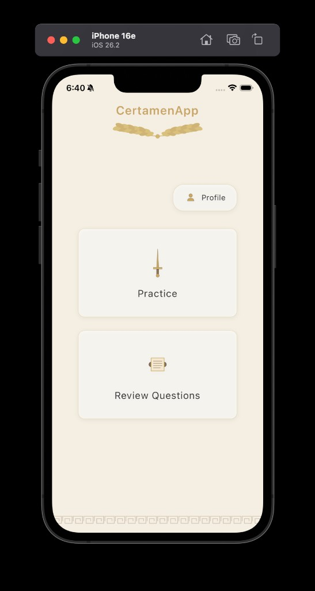

# CertamenPrep 🏛️

**Practice like it's real.**

A mobile learning app for Certamen-style practice with a Roman-themed UI. Master mythology, history, language, literature, culture, and living Latin while climbing eleven military ranks from **Miles** to **Legatus Legionis**.



**[Dev log](DEVLOG.md)** — day-to-day notes for the team (newest entry at the top).

**Current release:** iOS **1.1.1** (see `app.json`). Privacy: https://certamenprep.org/privacy/

---

## 📱 Overview

CertamenPrep helps Latin students and Certamen competitors study with authentic toss-up pacing, buzz-in timing, and progress tracking backed by Supabase. Four main tabs — **Home**, **Challenge**, **Review**, and **Practice** — keep daily study, rank progression, mistake review, and low-stakes practice one swipe away.

---

## ✨ Key Features

### 🏠 Home

- Rank, progress bar, mastered count, remaining questions in your current rank, review count, and **daily streak**
- **Start your Daily Challenge!** shortcut into Challenge Mode
- Sign in with **Google** or **Apple**, or use **Guest Mode**
- Log out or delete your account from Home

### ⚔️ Challenge Mode (main progression path)

- Questions stream **letter-by-letter**, like a real Certamen toss-up
- **BUZZ** after the clue finishes, then answer within a short timer
- Sets of **10–50 questions** drawn from your current **mastery rank pool**
- **11 Roman ranks** (Miles → Legatus Legionis), each tied to questions you master — not a separate points score
- **Hold the star** on a correct answer to mark a question mastered
- Wrong answers go to **Review** automatically
- End-of-set summary: mastered, correct (not mastered), and wrong
- **Daily streak** — play at least one Challenge question per local calendar day; confetti and a Roman-themed toast celebrate milestones, anniversaries, and comeback days

### 📖 Practice Mode (stress-free)

- Six categories: Mythology, History, Language, Literature, Culture & Life, Living Latin
- Same typewriter + buzz flow as Challenge Mode
- Wrong answers here **do not** enter Review — ideal for warming up or exploring a topic
- End-of-session summary for mastered vs missed

### 🔁 Review Mode

- Work through questions you missed in **Challenge Mode**
- Master a question in Review to remove it from your wrong list and count it toward mastered totals
- Category-based entry with on-screen tips

### ⚙️ Settings

- Challenge / practice session length (10–50 questions)
- Practice session difficulty
- Legacy **wrong questions only** toggle (Settings) for targeted drill sessions
- Roman-themed UI with gold and parchment tones

---

## 🎖️ Rank system

Ranks are earned by **mastering questions**, not by raw points:

| Rank | Name |
|------|------|
| 0 | Miles |
| 1 | Cornicen |
| 2 | Signifer |
| 3 | Optio |
| 4 | Centurio |
| 5 | Aquilifer |
| 6 | Primus Pilus |
| 7 | Praefectus Castrorum |
| 8 | Tribunus Angusticlavius |
| 9 | Tribunus Laticlavius |
| 10 | Legatus Legionis |

Each rank has its own question pool. Progress within a rank is shown as mastered vs total in that pool. See `lib/masteryRanks.ts` for thresholds and helpers.

---

## 🔥 Daily streak

- Counts **Challenge Mode only** (Practice and Review do not credit the streak)
- One credit per **local calendar day** (midnight to midnight on the device)
- First Challenge answer of the day triggers the streak bump
- Miss a full day → streak resets on next Home visit; playing again starts a new run at day 1
- Celebration: confetti from the laurel wreath + short toast (`StreakConfetti.tsx`, `getStreakCelebrateMessage()` in `userStatsService.ts`)

---

## 🚀 Installation

### Prerequisites

- Node.js 18+
- npm
- Expo dev client / EAS build (Apple Sign-In requires a **development or store build**, not Expo Go)
- iOS Simulator (Mac) or Android emulator
- Supabase project

### Clone and install

```bash
git clone https://github.com/yuanyx2015-dev/CertamenApp.git
cd CertamenApp
npm install
```

### Configure Supabase

1. Create a project at [supabase.com](https://supabase.com).
2. Copy **Project URL** and **anon key** into `lib/supabase.ts`.
3. Apply migrations in `supabase/migrations/` in filename order (SQL Editor or Supabase CLI).
4. Follow [guides/SUPABASE_SETUP.md](guides/SUPABASE_SETUP.md) for Google + Apple OAuth.
5. For Google redirect URLs, see [docs/oauth-console-checklist.md](docs/oauth-console-checklist.md).

### OAuth bundle IDs

```json
{
  "ios": { "bundleIdentifier": "com.ziyouyuan.certamenapp" },
  "android": { "package": "com.ziyouyuan.certamenapp" }
}
```

### Run locally

```bash
npm start          # Metro
npm run ios        # iOS simulator (dev client)
npm run ios:device # Physical iPhone
npm run android    # Android
```

---

## 📖 Usage

1. **Sign in** with Google or Apple, or tap **Continue as Guest** (Guest cannot use Review or cloud streaks).
2. **Home** — check rank, streak, and stats; start a daily Challenge.
3. **Challenge** — pick set size, play through your current rank pool, buzz in and answer.
4. **Review** — clear wrong questions from Challenge.
5. **Practice** — study by category without affecting Review.
6. **Swipe left/right** on the main tabs to switch quickly.

---

## 🛠️ Technologies

| Layer | Stack |
|-------|--------|
| Mobile | React Native 0.81, Expo ~54, TypeScript ~5.9 |
| UI | React Native SVG, Animated API |
| Backend | Supabase (Postgres, Auth, RLS) |
| Auth | Google OAuth, Sign in with Apple, guest mode |
| Local storage | AsyncStorage (settings, session) |

---

## 🗄️ Database (high level)

### Core tables

- `profiles` — user identity
- `user_stats` — streak, legacy stats, rank label
- `questions` — question bank with difficulty and rank assignment
- `user_mastered_answers` / `user_wrong_answers` / `user_passed_answers` — per-user question state
- `user_settings` — session preferences

### Notable RPCs / functions

- `bump_user_streak(p_user_id, p_today)` — daily streak (client passes local date)
- `get_unmastered_questions` — Challenge pool for a rank
- `get_difficulty_stats` / rank pool helpers — Home and Challenge progress
- `master_question`, `mark_wrong_question`, `record_passed_question` — atomic question state updates

Legacy SQL under `SQL stuff/` may predate migrations; prefer `supabase/migrations/` for new environments.

---

## 🎨 Design

- Parchment background (`#f5efe3`), gold accents (`#c9a961`, `#d4b76a`), maroon highlights
- Laurel wreath header, meander footer, custom SVG icons
- Press animations and streak confetti celebrations

---

## 🔐 Security & privacy

- Row Level Security on user data
- OAuth-only sign-in (no passwords stored in-app)
- Account deletion from Home
- See [PRIVACY.md](PRIVACY.md) for App Store privacy copy

---

## 📂 Project structure

```
CertamenApp/
├── components/
│   ├── MainTabsScreen.tsx      # Home / Challenge / Review / Practice tabs
│   ├── ChallengeGameScreen.tsx # Challenge + Review gameplay
│   ├── PracticeGameScreen.tsx
│   ├── InformationScreen.tsx   # Home / profile stats
│   ├── StreakConfetti.tsx      # Streak celebration overlay
│   ├── RomanBackground.tsx     # App shell + navigation
│   └── …
├── services/                   # Auth, stats, questions, mastery, review
├── lib/                        # supabase.ts, masteryRanks.ts, appReview.ts
├── supabase/migrations/        # Ordered DB migrations
├── guides/                     # Setup and integration docs
├── docs/                       # OAuth checklist, etc.
├── app.json                    # Expo / App Store version & bundle IDs
└── README.md
```

---

## 🗺️ Roadmap

- [x] Four-tab navigation (Home, Challenge, Review, Practice)
- [x] Mastery-based 11-rank progression
- [x] Daily streak with local timezone + celebrations
- [ ] PvP / match modes (UI placeholders exist)
- [ ] Leaderboards
- [ ] Offline caching
- [ ] AI tutor enhancements (partial backend in migrations)

---

## 🐛 Known issues

- Apple Sign-In is unreliable on the **iOS Simulator**; use a physical device or Google for auth testing
- Google OAuth in the simulator occasionally needs a simulator restart if the callback returns without tokens
- Settings **wrong questions only** mode is legacy; main flows are Challenge / Review / Practice tabs

---

## 🤝 Contributing

1. Fork the repo
2. Create a feature branch
3. Commit with clear messages (`Fix/…`, `Add/…`, `Update/…`)
4. Test on iOS and/or Android dev builds
5. Open a pull request

---

## 📄 License

MIT — see [LICENSE](LICENSE) if present.

---

## 👨‍💻 Author

**yuanyx2015-dev** · [GitHub](https://github.com/yuanyx2015-dev) · [CertamenApp](https://github.com/yuanyx2015-dev/CertamenApp)

---

## 📞 Support

- [GitHub Issues](https://github.com/yuanyx2015-dev/CertamenApp/issues)
- [Supabase setup guide](guides/SUPABASE_SETUP.md)
- [OAuth console checklist](docs/oauth-console-checklist.md)

---

**Happy studying. Vale!** 🏛️
